# Provision Wercker for Work Better Application

## Preparing Wercker

Before you can use Wercker to build and deploy to a OKE cluster, you must have access to a:

- GitHub account
- Wercker account
- An OKE cluster
- A forked Work Better repository


## Create Wercker Application

### **STEP 1**: Fork Java Application on GitHub

- From any browser, go to:

    [GitHub account - https://github.com/kwanwan/WorkBetter](https://github.com/kwanwan/WorkBetter)

- Click **Fork** in the upper right hand corner of the browser. **Sign in** if prompted.

  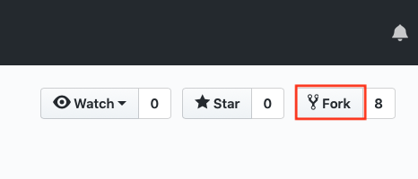

  **NOTE:** If prompted, choose to fork the repository to your account (this may occur if your account is also a member of an organization on GitHub).


### **Step 2**: Sign into Wercker


It is assumed you already have a Wercker account. Use your account to log into Wercker. Otherwise, you have to sign up for a Wercker account before proceeding further.

- Go to the Wercker Home and log in with you GitHub account. In a new browser tab, go to:

  https://app.wercker.com

- Click **LOGIN WITH GITHUB** if you have associated your existing Wercker account with your GitHub account.

  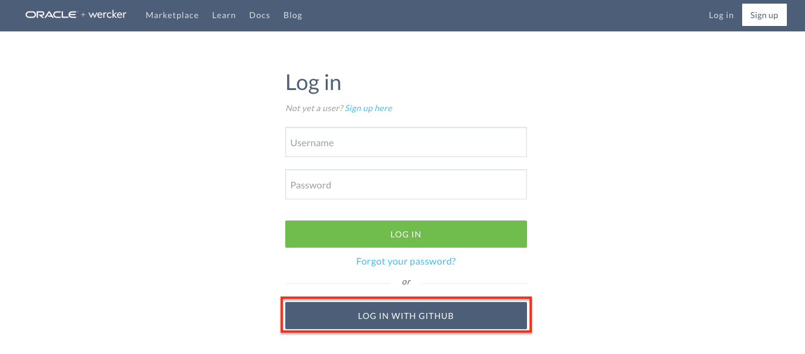


### **Step 3**: Create a Wercker Application


To create an application (aka project) in Wercker, you need to log in to Wercker with a GitHub account. Your Wercker account should be associated with your GitHub accout when you signed up.


- Once logged in, click on the **+** sign icon on the top right hand corner of the page and select **Add application** from the drop down list.

  

- Select **GitHub** as your SCM on the **Create New Application** page, and click **Next**

  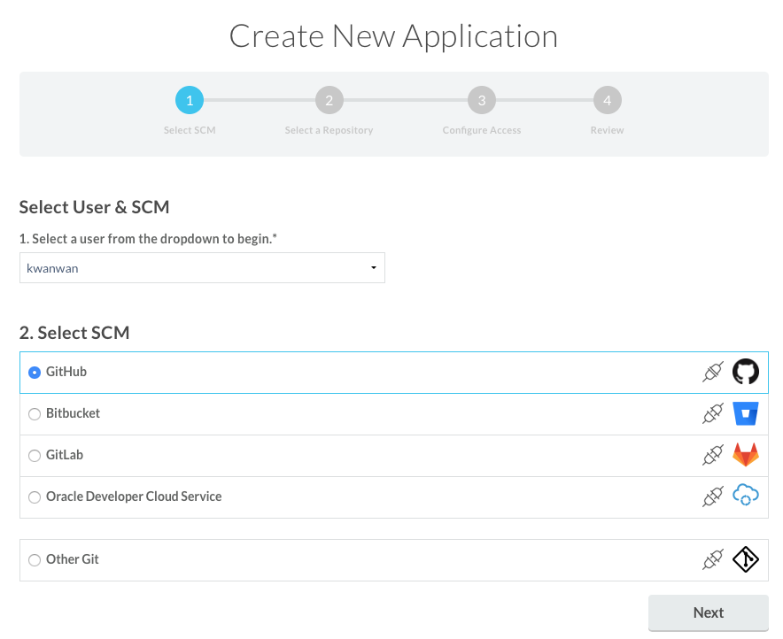

- Select your forked **WorkBetter** repository from the **Select a Repository** step, and click **Next**

  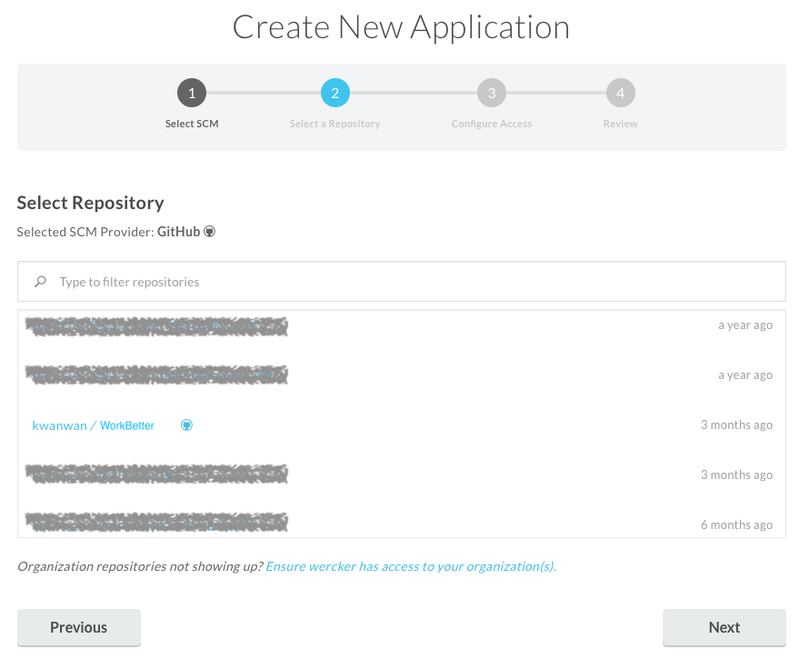

- Leave the recommended selection on the **Configure Access** step to use **wercker will check out the code without using an SSH key**, and click **Next**

  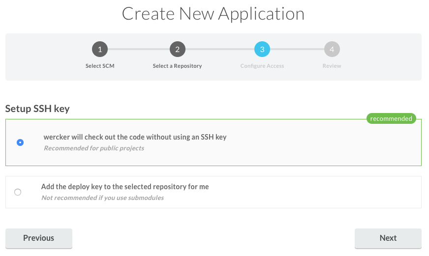

- Review your selections as below and click **Create**

  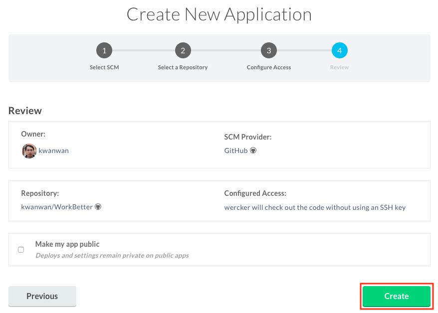


### **Step 4**: Create a Pipelines and Workflow in Wercker

We will now create the pipelines **functional-test** and **deploy**. There will be a corresponding implementation of these pipelines in the `wercker.yml` file in your WorkBetter repo.

  - Navigate to the Wercker page for your newly-created application (you will already be on that page if you just completed STEP 3). Notice that you are viewing the Runs tab. This is where any executions of your workflow will be recorded.

    


  - Click the **Workflows** tab. You will see that Wercker has created the beginning of a workflow for you already. This workflow is triggered by a Git commit and it will execute a pipeline called **build**.

    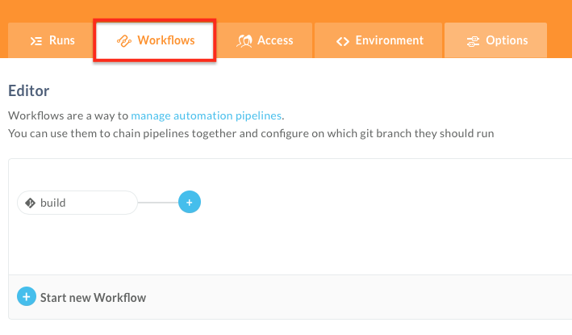

  - The **build** pipeline will be used to build and unit test our application. Let's create a new pipeline to store the resulting Docker image in a Docker Hub repository. Click the **Add new pipeline** button.

  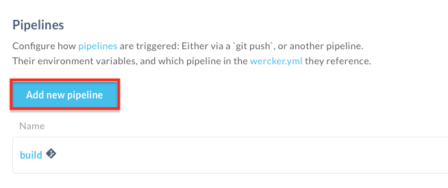

  - Fill in `functional-test` for the name of the pipeline and the YML name of the pipeline and click **Create**.

  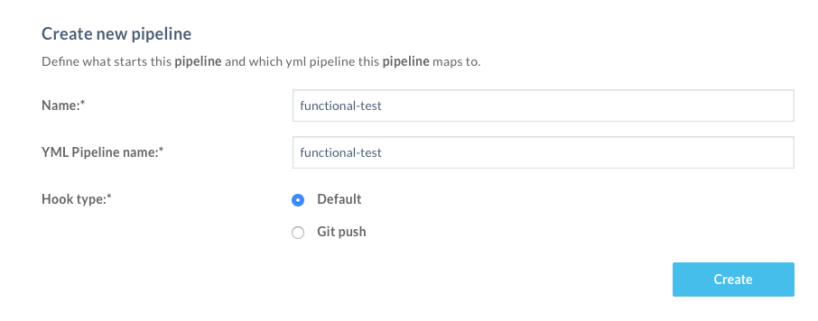

  - Click the **Workflows** tab to return to the workflow page.

  - Now create another pipeline. Click the **Add new pipeline** button.

  - Fill in `deploy` for the name of the pipeline and the YML name of the pipeline and click **Create**.

    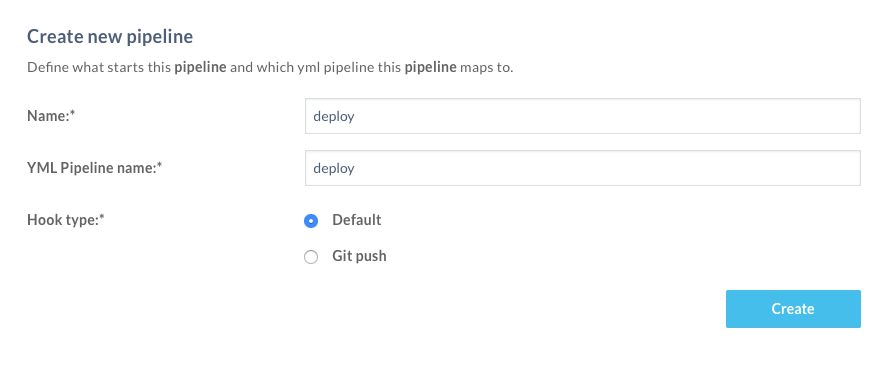

  - Now that you've created the pipeline, click on the **Workflows** tab to return to the workflow editor. Click the **plus sign** next to the **build** pipeline in the editor.

    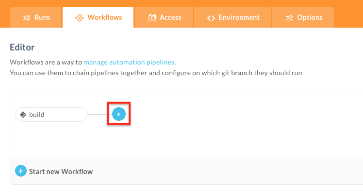


  - In the **Execute pipeline** drop down list, choose the pipeline we just created, **functional-test**. Leave the other fields at their default values and click **Add**.

    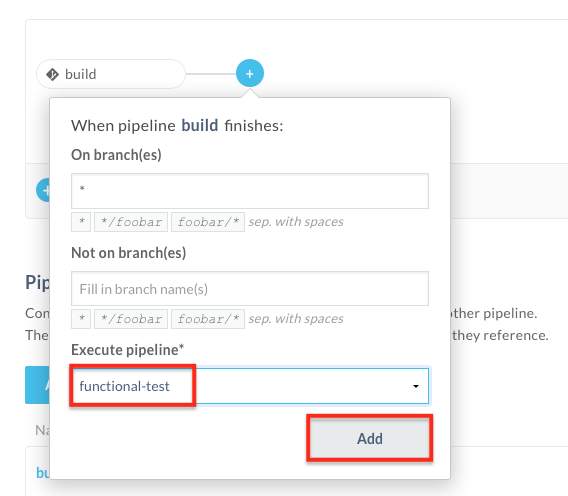

  - Now add the **deploy** pipeline after the **function-test**. Click the **plus sign** next to the **function-test** pipeline in the editor. Choose the **deploy** pipeline from the **Execute pipeline** and enter `master` in the **On branch(es)** field.

    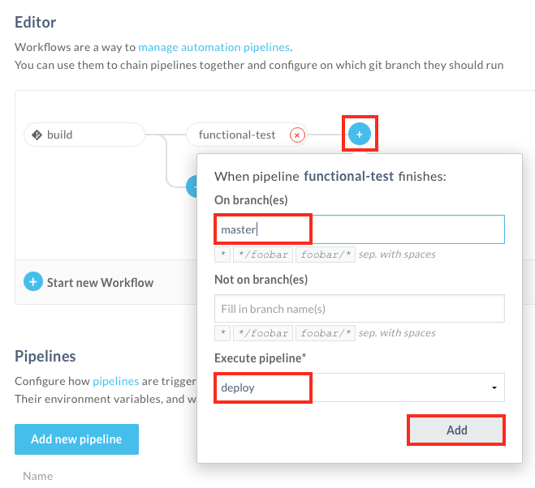


### **Step 5**: Set Environment Variables in Wercker

  - In your Wercker browser tab, click the **Environment** tab.

    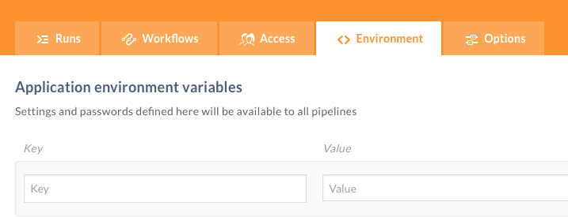

  - Create an environment variable by filling in the **Key** and **Value** boxes and clicking **Add**. Repeat this step for each variable listed below and complete the values for your OCI environment.

  ```
  Key:              Value:
  NS                <name of your namespace> (e.g. demo)
  KUBERNETES_MASTER <Kubenetes master node IP> (Find this in kubeconfig. e.g. https://xxx.xxx.xxx.xxx:6443)
  KUBERNETES_TOKEN  <Kubernetes user token> (Find this in kubeconfig.)
  DOCKER_USER       <tenancy name>/<user> (Use your OCI user. e.g. gse000111111/api.user)
  DOCKER_PASSWORD   <auth_token> (OCI user generated Auth token)
  DOCKER_REPO       <tenancy name>/<registry name> (e.g. iad.ocir.io/gse000111111/workbetter)
  DOCKER_REGISTRY   <region> (e.g. iad.ocir.io)
```

    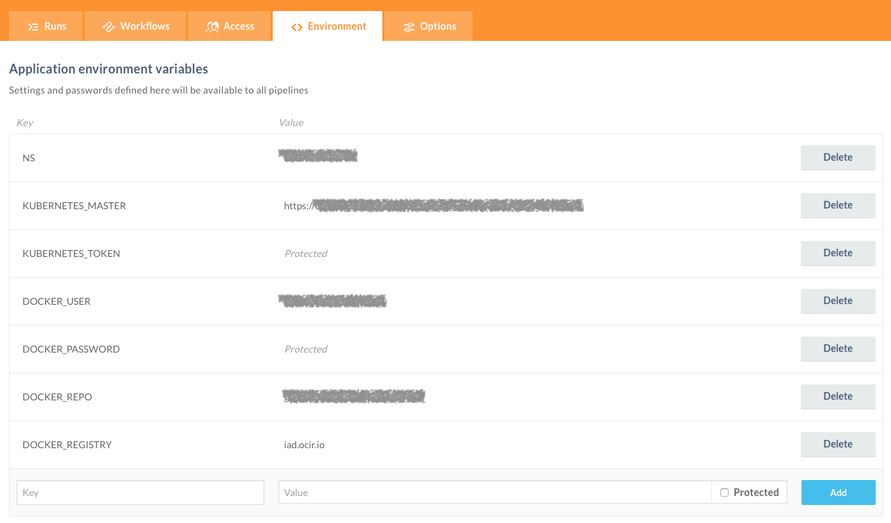


### **Step 6**: Validate Workflow executions

We will now test the workflow by manually executing the workflow. The workflow would normally be trigger by a code commit to the repo. However, since we haven't made any changes to the code, we would need to manually execute the workflow manually.

- Click the **Runs** tab within Wercker. Click **trigger a build now** at the bottom of the page manually excute the workflow.

    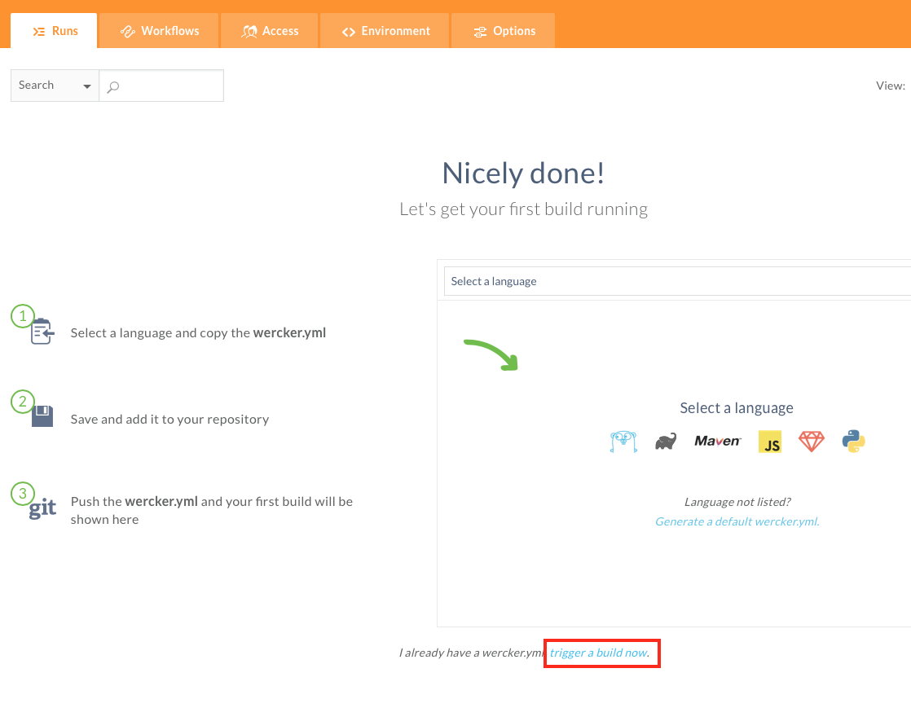


- The workflow will start executing with the **build** pipeline and if successful, it will execute the next pipeline **functional-test**, followed by **deploy**.

    

- Once the workflow finishes, you'll see the **build**, **functional-test** and **deploy** pipelines turn green to indicate success.

    

- To check that the images pushed successfully to the OCI Registry, login to your OCI instance. Type in a browser https://console.us-ashburn-1.oraclecloud.com/#/a/

- Select **Developer Services** > **Registry (OCIR)**.

    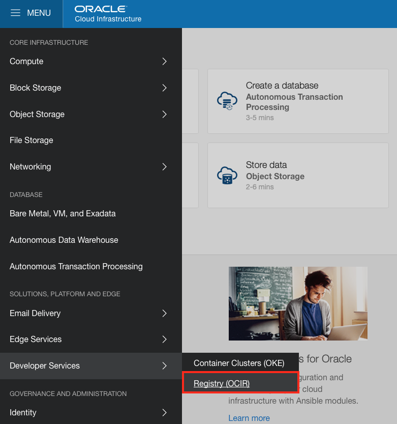

- The list of repositories in the OCI Registry is displayed. Expand the repository to see the images you pushed.

    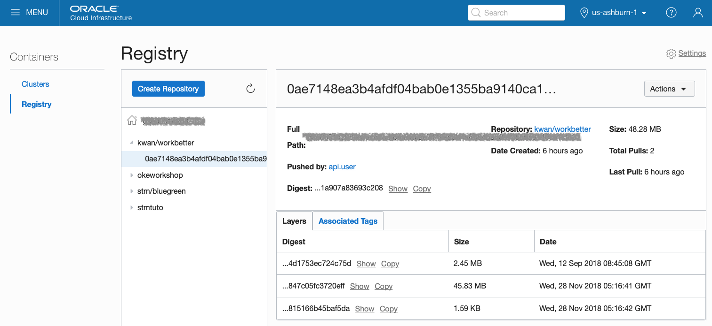


**You have completed the configuration of a Wercker application. You are now ready to show the demo.**


[Go to Demo Instruction](README.md)
